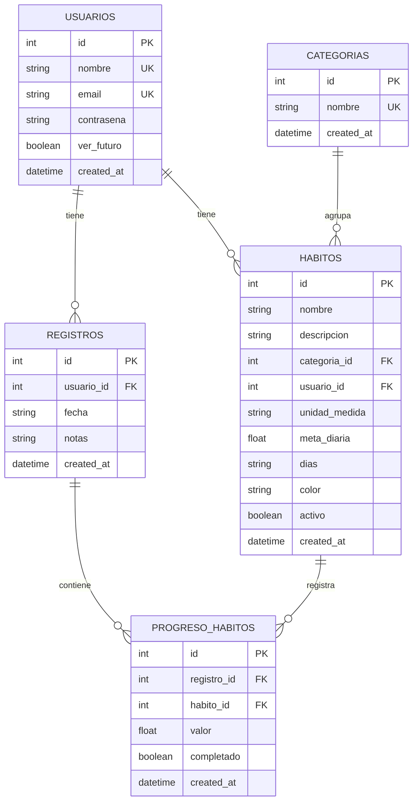

# 🎯 Marco - Habit Tracker

<div align="center">


**Una aplicación moderna para el seguimiento de hábitos diarios**

[🚀 Demo](#-inicio-rápido) • [📖 Documentación](#-estructura-del-proyecto) • [🛠️ Instalación](#️-instalación)

</div>

---

## 📋 Descripción

**Marco** es una aplicación full-stack de seguimiento de hábitos que te ayuda a construir y mantener rutinas saludables. Con una interfaz elegante y moderna, puedes:

- ✅ Crear y gestionar hábitos personalizados
- 📅 Programar hábitos para días específicos de la semana
- 📊 Visualizar tu progreso diario con barras de progreso animadas
- 🎨 Personalizar colores para cada hábito
- 🔔 Recibir notificaciones visuales cuando no puedes ver el futuro
- ✨ Disfrutar de animaciones fluidas y efectos visuales atractivos

---

## ✨ Características

### 🎨 Interfaz de Usuario
- **Diseño Oscuro Premium** - Tema oscuro elegante con acentos de color vibrantes
- **Animaciones Fluidas** - Transiciones suaves al agregar, eliminar y completar hábitos
- **Efecto Neon Gradient** - Barra de progreso con efecto neón (púrpura → rojo → naranja) al completar todos los hábitos
- **Responsive Design** - Funciona perfectamente en móviles, tablets y escritorio

### 📱 Funcionalidades
| Característica | Descripción |
|----------------|-------------|
| 🎯 **Gestión de Hábitos** | Crear, editar y eliminar hábitos con facilidad |
| 📅 **Programación Flexible** | Asigna hábitos a días específicos (L, M, X, J, V, S, D) |
| 📈 **Seguimiento de Progreso** | Registra valores y marca hábitos como completados |
| 🗓️ **Navegación por Fechas** | Navega entre días para revisar tu historial |
| ⚙️ **Configuración de Usuario** | Controla si puedes ver días futuros |
| 🗑️ **Eliminación en Cascada** | Al eliminar un hábito, se eliminan todos sus registros |

### 🎭 Efectos Visuales
- **Shake Animation** - Sacudida suave al intentar ver el futuro (cuando está deshabilitado)
- **Slide Out Animation** - Animación de deslizamiento al eliminar tarjetas
- **Toast Notifications** - Notificaciones flotantes temporales
- **Bulb Flicker Effect** - Parpadeo sutil en la barra de progreso completada

---

## 🛠️ Tech Stack

### Backend
```
🐍 Python 3.12+
⚡ FastAPI - Framework web moderno y de alto rendimiento
🗃️ SQLAlchemy - ORM asíncrono con aiosqlite
📦 Pydantic v2 - Validación de datos
🔄 Uvicorn - Servidor ASGI
📧 Email-Validator - Validación de emails
```

### Frontend
```
🔥 SvelteKit 2.0 - Framework de aplicaciones web
⚡ Svelte 5 - Con Runes ($state, $effect)
🎨 Tailwind CSS 4 - Framework de utilidades CSS
📦 Vite 6 - Build tool ultrarrápido
📝 TypeScript - Tipado estático
```

### Base de Datos
```
💾 SQLite - Base de datos ligera y embebida
📁 Almacenamiento local en app.db
```

---

## 📁 Estructura del Proyecto

```
marco/
├── 📂 backend/
│   ├── 📂 app/
│   │   ├── 📄 main.py          # Punto de entrada FastAPI
│   │   ├── 📄 config.py        # Configuración de la app
│   │   ├── 📄 database.py      # Conexión a BD y sesiones
│   │   ├── 📄 models.py        # Modelos SQLAlchemy
│   │   ├── 📄 schemas.py       # Esquemas Pydantic
│   │   └── 📂 routers/
│   │       ├── 📄 usuarios.py      # CRUD de usuarios
│   │       ├── 📄 categorias.py    # CRUD de categorías
│   │       ├── 📄 habitos.py       # CRUD de hábitos
│   │       ├── 📄 registros.py     # Registros diarios
│   │       └── 📄 habito_dias.py   # Días de hábitos
│   ├── 📄 pyproject.toml       # Dependencias Python (UV)
│   └── 📄 app.db               # Base de datos SQLite
│
├── 📂 frontend/
│   ├── 📂 src/
│   │   ├── 📂 lib/
│   │   │   ├── 📄 api.ts           # Cliente API
│   │   │   └── 📂 components/
│   │   │       ├── 📄 Chart.svelte
│   │   │       ├── 📄 ConfirmModal.svelte
│   │   │       └── 📄 HabitoForm.svelte
│   │   └── 📂 routes/
│   │       ├── 📄 +page.svelte     # Página de progreso
│   │       ├── 📄 +layout.svelte   # Layout principal
│   │       ├── 📂 habitos/         # Gestión de hábitos
│   │       ├── 📂 charts/          # Visualizaciones
│   │       ├── 📂 items/           # Items
│   │       ├── 📂 progreso/        # Progreso detallado
│   │       └── 📂 settings/        # Configuración
│   ├── 📄 package.json
│   ├── 📄 svelte.config.js
│   ├── 📄 vite.config.ts
│   └── 📄 tsconfig.json
│
└── 📄 README.md
```

---

## ⚙️ Instalación

### 📋 Prerrequisitos

- **Python 3.12+** - [Descargar](https://python.org)
- **Node.js 18+** - [Descargar](https://nodejs.org)
- **UV** (Gestor de paquetes Python) - [Instalar](https://github.com/astral-sh/uv)
- **pnpm** (opcional, recomendado) - [Instalar](https://pnpm.io)

### 🚀 Inicio Rápido

#### 1️⃣ Clonar el repositorio
```bash
git clone https://github.com/jorge07RD/marco.git
cd marco
```

#### 2️⃣ Configurar el Backend
```bash
cd backend

# Instalar dependencias con UV
uv sync

# Iniciar el servidor de desarrollo
uv run uvicorn app.main:app --reload --port 8000
```

El backend estará disponible en: `http://127.0.0.1:8000`

📚 Documentación API: `http://127.0.0.1:8000/docs`

#### 3️⃣ Configurar el Frontend
```bash
cd frontend

# Instalar dependencias
pnpm install
# o con npm: npm install

# Iniciar el servidor de desarrollo
pnpm dev
# o con npm: npm run dev
```

El frontend estará disponible en: `http://localhost:5173`

---

## 🗄️ Modelo de Datos



---

## 🔌 API Endpoints

### 👤 Usuarios
| Método | Endpoint | Descripción |
|--------|----------|-------------|
| `GET` | `/api/usuarios/` | Listar todos los usuarios |
| `GET` | `/api/usuarios/{id}` | Obtener usuario por ID |
| `POST` | `/api/usuarios/` | Crear nuevo usuario |
| `PUT` | `/api/usuarios/{id}/` | Actualizar usuario |
| `DELETE` | `/api/usuarios/{id}/` | Eliminar usuario |

### 📁 Categorías
| Método | Endpoint | Descripción |
|--------|----------|-------------|
| `GET` | `/api/categorias/` | Listar categorías |
| `POST` | `/api/categorias/` | Crear categoría |

### 🎯 Hábitos
| Método | Endpoint | Descripción |
|--------|----------|-------------|
| `GET` | `/api/habitos/usuario/{id}` | Hábitos de un usuario |
| `POST` | `/api/habitos/` | Crear hábito |
| `PUT` | `/api/habitos/{id}/` | Actualizar hábito |
| `DELETE` | `/api/habitos/{id}` | Eliminar hábito (cascada) |

### 📅 Registros
| Método | Endpoint | Descripción |
|--------|----------|-------------|
| `GET` | `/api/registros/usuario/{id}/fecha/{fecha}` | Obtener/crear registro |
| `PUT` | `/api/registros/{id}/progreso/{progreso_id}/` | Actualizar progreso |

---

## 🎨 Paleta de Colores

| Color | Hex | Uso |
|-------|-----|-----|
| 🖤 **Background Primary** | `#0E0D0D` | Fondo principal |
| 💜 **Border** | `#533483` | Bordes y acentos secundarios |
| ❤️ **Accent** | `#e94560` | Acentos y botones principales |
| 💚 **Success** | `#00ff88` | Estados de éxito y completado |
| ⚪ **Text Primary** | `#FFFFFF` | Texto principal |
| 🔵 **Text Secondary** | `#A0A0A0` | Texto secundario |

---

## 📱 Capturas de Pantalla

<div align="center">

### Página Principal - Progreso Diario
*Vista del progreso con barra neon gradient al completar todos los hábitos*

### Gestión de Hábitos
*Crear, editar y eliminar hábitos con animaciones fluidas*

### Configuración
*Toggle para ver días futuros con auto-guardado*

</div>

---

## 🤝 Contribuir

¡Las contribuciones son bienvenidas! Por favor, sigue estos pasos:

1. 🍴 Fork el repositorio
2. 🌿 Crea una rama para tu feature (`git checkout -b feature/AmazingFeature`)
3. 💾 Commit tus cambios (`git commit -m 'Add some AmazingFeature'`)
4. 📤 Push a la rama (`git push origin feature/AmazingFeature`)
5. 🔃 Abre un Pull Request

---

## 📄 Licencia

Este proyecto está bajo la Licencia MIT. Ver el archivo `LICENSE` para más detalles.

---

## 👨‍💻 Autor

**Jorge** - [@jorge07RD](https://github.com/jorge07RD)

---

<div align="center">

**⭐ Si te gusta este proyecto, no olvides darle una estrella ⭐**

Hecho con ❤️ y ☕

</div>
