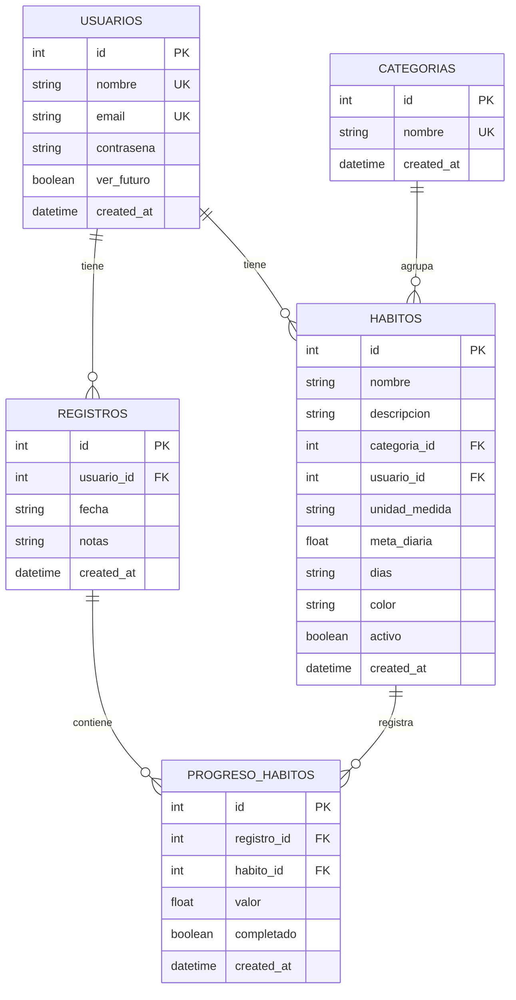

# 🎯 Marco - Habit Tracker

<div align="center">


**Una aplicación moderna para el seguimiento de hábitos diarios**

[🚀 Demo](#-inicio-rápido) • [📖 Documentación](#-estructura-del-proyecto) • [🛠️ Instalación](#️-instalación)

</div>

---

## 📋 Descripción

**Marco** es una aplicación full-stack de seguimiento de hábitos que te ayuda a construir y mantener rutinas saludables. Con una interfaz elegante y moderna, puedes:

- 🔐 **Sistema de autenticación completo** con JWT (registro, login, logout)
- 👤 **Datos separados por usuario** - cada usuario ve solo sus propios hábitos
- ✅ Crear y gestionar hábitos personalizados
- 📅 Programar hábitos para días específicos de la semana
- 📊 Visualizar tu progreso diario con barras de progreso animadas
- 📈 **Análisis avanzado con 8 tipos de gráficos** (Area, Polar, Pie, Spline, Column, Gauge, Radar, Bar)
- 🗓️ **Vista de calendario mensual** - Visualiza todo tu progreso del mes con código de colores
- 🗓️ **Filtros de fecha flexibles** con shortcuts rápidos (este mes, última semana, etc.)
- 🎨 Personalizar colores para cada hábito
- 🔔 Recibir notificaciones visuales cuando no puedes ver el futuro
- ✨ Disfrutar de animaciones fluidas y efectos visuales atractivos

---


## ✨ Características

### 🎨 Interfaz de Usuario
- **Diseño Oscuro Premium** - Tema oscuro elegante con acentos de color vibrantes
- **Animaciones Fluidas** - Transiciones suaves y animaciones personalizadas de carga
- **Efecto Neon Gradient** - Barra de progreso con efecto neón (púrpura → rojo → naranja) al completar todos los hábitos
- **Responsive Design** - Funciona perfectamente en móviles, tablets y escritorio
- **UX Móvil Optimizada** - Navegación estable y sin interrupciones en dispositivos móviles

### 📱 Funcionalidades
| Característica | Descripción |
|----------------|-------------|
| 🔐 **Autenticación JWT** | Registro, login y logout seguros con tokens JWT |
| 👤 **Multi-usuario** | Cada usuario tiene sus propios datos completamente separados |
| 🛡️ **Protección de Rutas** | Redirección automática a login si no estás autenticado |
| 🎯 **Gestión de Hábitos** | Crear, editar y eliminar hábitos con facilidad |
| 📁 **Gestión de Categorías** | CRUD completo de categorías para organizar tus hábitos |
| 📅 **Programación Flexible** | Asigna hábitos a días específicos (L, M, X, J, V, S, D) |
| 📈 **Seguimiento de Progreso** | Registra valores y marca hábitos como completados |
| 🗓️ **Navegación por Fechas** | Navega entre días para revisar tu historial |
| 📅 **Calendario Mensual** | Vista completa del mes con código de colores según porcentaje de cumplimiento |
| 📊 **Análisis Avanzado** | 8 gráficos interactivos con Highcharts para visualizar tu rendimiento |
| 📈 **Reportes Personalizados** | Filtra por rango de fechas y obtén insights de tu progreso |
| ⚙️ **Configuración de Usuario** | Controla si puedes ver días futuros y edita tu perfil |
| 🗑️ **Eliminación en Cascada** | Al eliminar un hábito, se eliminan todos sus registros |

### 🎭 Efectos Visuales
- **Animaciones Personalizadas** - Sistema de carga con animaciones modernas que reemplazan spinners tradicionales
- **Shake Animation** - Sacudida suave al intentar ver el futuro (cuando está deshabilitado)
- **Slide Out Animation** - Animación de deslizamiento al eliminar tarjetas
- **Toast Notifications** - Notificaciones flotantes temporales
- **Bulb Flicker Effect** - Parpadeo sutil en la barra de progreso completada
- **Navegación Móvil Optimizada** - Navbar estable sin desapariciones durante animaciones

---

## 🛠️ Tech Stack

### Backend
```
🐍 Python 3.12+
⚡ FastAPI - Framework web moderno y de alto rendimiento
🗃️ SQLAlchemy - ORM asíncrono con aiosqlite
📦 Pydantic v2 - Validación de datos
🔒 BCrypt - Hashing seguro de contraseñas
🔑 Python-Jose - Generación y verificación de tokens JWT
🔄 Uvicorn - Servidor ASGI
📧 Email-Validator - Validación de emails
```

### Frontend
```
🔥 SvelteKit 2.9 - Framework de aplicaciones web
⚡ Svelte 5.12 - Con Runes ($state, $effect)
🎨 Tailwind CSS 4.1 - Framework de utilidades CSS
📊 Highcharts 12.1 - Librería de gráficos interactivos
📦 Vite 6.0 - Build tool ultrarrápido
📝 TypeScript 5.7 - Tipado estático
```

### Base de Datos
```
💾 SQLite - Base de datos ligera y embebida
📁 Almacenamiento local en app.db
```

---

## 📁 Estructura del Proyecto

```
marco/
├── 📂 backend/
│   ├── 📂 app/
│   │   ├── 📄 main.py          # Punto de entrada FastAPI
│   │   ├── 📄 config.py        # Configuración de la app
│   │   ├── 📄 database.py      # Conexión a BD y sesiones
│   │   ├── 📄 models.py        # Modelos SQLAlchemy
│   │   ├── 📄 schemas.py       # Esquemas Pydantic
│   │   ├── 📄 security.py      # Autenticación y seguridad
│   │   └── 📂 routers/
│   │       ├── 📄 auth.py          # 🔐 Registro, login, perfil
│   │       ├── 📄 usuarios.py      # CRUD de usuarios
│   │       ├── 📄 categorias.py    # CRUD de categorías
│   │       ├── 📄 habitos.py       # CRUD de hábitos (protegido)
│   │       ├── 📄 registros.py     # Registros diarios (protegido)
│   │       ├── 📄 analisis.py      # 📊 Endpoints de análisis (protegido)
│   │       └── 📄 habito_dias.py   # Días de hábitos
│   ├── 📄 pyproject.toml       # Dependencias Python (UV)
│   └── 📄 app.db               # Base de datos SQLite
│
├── 📂 frontend/
│   ├── 📂 src/
│   │   ├── 📂 lib/
│   │   │   ├── 📄 api.ts           # Cliente API con auth
│   │   │   ├── 📂 stores/
│   │   │   │   └── 📄 auth.svelte.ts  # 🔐 Auth store (Svelte 5 Runes)
│   │   │   └── 📂 components/
│   │   │       ├── 📄 Chart.svelte
│   │   │       ├── 📄 ConfirmModal.svelte
│   │   │       └── 📄 HabitoForm.svelte
│   │   └── 📂 routes/
│   │       ├── 📄 +page.svelte     # Página de progreso
│   │       ├── 📄 +layout.svelte   # Layout con protección de rutas
│   │       ├── 📂 login/           # 🔐 Login
│   │       ├── 📂 register/        # 🔐 Registro
│   │       ├── 📂 habitos/         # Gestión de hábitos
│   │       ├── 📂 analisis/        # 📊 Análisis y reportes (8 gráficos)
│   │       ├── 📂 calendario/      # 📅 Vista de calendario mensual
│   │       ├── 📂 charts/          # Visualizaciones (legacy)
│   │       ├── 📂 items/           # Items
│   │       ├── 📂 progreso/        # Progreso detallado
│   │       └── 📂 settings/        # Configuración de usuario
│   ├── 📄 package.json
│   ├── 📄 svelte.config.js
│   ├── 📄 vite.config.ts
│   └── 📄 tsconfig.json
│
├── 📄 README.md
└── 📄 AUTENTICACION.md         # 🔐 Guía de autenticación
```

---

## ⚙️ Instalación

### 📋 Prerrequisitos

- **Python 3.12+** - [Descargar](https://python.org)
- **Node.js 18+** - [Descargar](https://nodejs.org)
- **UV** (Gestor de paquetes Python, solo para backend) - [Instalar](https://github.com/astral-sh/uv)
- **pnpm** (opcional, recomendado para frontend) - [Instalar](https://pnpm.io)

### 🚀 Inicio Rápido

#### 1️⃣ Clonar el repositorio
```bash
git clone https://github.com/jorge07RD/marco.git
cd marco
```

#### 2️⃣ Configurar el Backend
```bash
cd backend

# Instalar dependencias con UV (crea el venv automáticamente)
uv sync

# Iniciar el servidor de desarrollo
uv run uvicorn app.main:app --reload --port 8000
```

El backend estará disponible en: `http://127.0.0.1:8000`

📚 Documentación API: `http://127.0.0.1:8000/docs`

#### 3️⃣ Configurar el Frontend
```bash
cd frontend

# Instalar dependencias
npm install
# o con pnpm: pnpm install

# Iniciar el servidor de desarrollo
npm run dev
# o con pnpm: pnpm dev
```

El frontend estará disponible en: `http://localhost:5173`

---

## 🔐 Autenticación y Seguridad

Marco implementa un sistema de autenticación robusto y seguro:

### Características de Seguridad

- **🔑 JWT Tokens** - Autenticación basada en tokens con expiración de 7 días
- **🔒 BCrypt** - Hashing de contraseñas con bcrypt (límite de 72 bytes)
- **🛡️ Protección de Rutas** - Todos los endpoints de hábitos y registros están protegidos
- **👤 Separación de Datos** - Cada usuario solo puede acceder a sus propios datos
- **🔄 Auto-redirect** - Redirección automática a login si el token expira (401)
- **📱 Estado Reactivo** - Auth store con Svelte 5 Runes para estado global

### Primeros Pasos

1. **Registra una cuenta** en `/register`
2. **Inicia sesión** en `/login` - recibirás un token JWT
3. **Crea tus hábitos** - solo tú podrás verlos y editarlos
4. **Edita tu perfil** en `/settings` - actualiza nombre, email o activa "ver futuro"

### Para Desarrolladores

📖 Consulta [AUTENTICACION.md](AUTENTICACION.md) para:
- Detalles técnicos de implementación
- Ejemplos de código para integración
- Estructura de tokens JWT
- Breaking changes en la API

### ⚠️ Importante para Producción

**Antes de desplegar en producción, DEBES cambiar el `secret_key` en `backend/app/config.py`:**

```bash
# Genera una clave segura:
openssl rand -hex 32

# Actualiza backend/app/config.py:
secret_key: str = "tu-clave-super-secreta-generada-aqui"
```

O mejor aún, usa variables de entorno:
```bash
export SECRET_KEY="tu-clave-super-secreta-generada-aqui"
```

---

## 🗄️ Modelo de Datos


```mermaid
erDiagram
    USUARIOS ||--o{ HABITOS : tiene
    USUARIOS ||--o{ REGISTROS : tiene
    CATEGORIAS ||--o{ HABITOS : agrupa
    REGISTROS ||--o{ PROGRESO_HABITOS : contiene
    HABITOS ||--o{ PROGRESO_HABITOS : registra
    
    USUARIOS {
        int id PK
        string nombre UK
        string email UK
        string contrasena
        boolean ver_futuro
        datetime created_at
    }
    
    CATEGORIAS {
        int id PK
        string nombre UK
        datetime created_at
    }
    
    HABITOS {
        int id PK
        string nombre
        string descripcion
        int categoria_id FK
        int usuario_id FK
        string unidad_medida
        float meta_diaria
        string dias
        string color
        boolean activo
        datetime created_at
    }
    
    REGISTROS {
        int id PK
        int usuario_id FK
        string fecha
        string notas
        datetime created_at
    }
    
    PROGRESO_HABITOS {
        int id PK
        int registro_id FK
        int habito_id FK
        float valor
        boolean completado
        datetime created_at
    }
```

---

## 🔌 API Endpoints

### 🔐 Autenticación (Públicos)
| Método | Endpoint | Descripción |
|--------|----------|-------------|
| `POST` | `/api/auth/register` | Registrar nuevo usuario |
| `POST` | `/api/auth/login` | Iniciar sesión (retorna JWT) |
| `GET` | `/api/auth/me` | 🔒 Obtener usuario actual |
| `PUT` | `/api/auth/me` | 🔒 Actualizar usuario actual |

### 👤 Usuarios
| Método | Endpoint | Descripción |
|--------|----------|-------------|
| `GET` | `/api/usuarios/` | Listar todos los usuarios |
| `GET` | `/api/usuarios/{id}` | Obtener usuario por ID |
| `POST` | `/api/usuarios/` | Crear nuevo usuario |
| `PUT` | `/api/usuarios/{id}/` | Actualizar usuario |
| `DELETE` | `/api/usuarios/{id}/` | Eliminar usuario |

### 📁 Categorías (Protegidas 🔒)
| Método | Endpoint | Descripción |
|--------|----------|-------------|
| `GET` | `/api/categorias/` | Listar todas las categorías |
| `GET` | `/api/categorias/{id}` | Obtener categoría por ID |
| `POST` | `/api/categorias/` | Crear nueva categoría |
| `PUT` | `/api/categorias/{id}` | Actualizar categoría |
| `DELETE` | `/api/categorias/{id}` | Eliminar categoría |

### 🎯 Hábitos (Protegidos 🔒)
| Método | Endpoint | Descripción |
|--------|----------|-------------|
| `GET` | `/api/habitos/` | Obtener hábitos del usuario autenticado |
| `POST` | `/api/habitos/` | Crear hábito para usuario autenticado |
| `GET` | `/api/habitos/{id}` | Obtener hábito por ID |
| `PUT` | `/api/habitos/{id}` | Actualizar hábito |
| `DELETE` | `/api/habitos/{id}` | Eliminar hábito (cascada) |

### 📅 Registros (Protegidos 🔒)
| Método | Endpoint | Descripción |
|--------|----------|-------------|
| `GET` | `/api/registros/fecha/{fecha}` | Obtener/crear registro para fecha |
| `POST` | `/api/registros/progreso/toggle/{id}` | Alternar completado de progreso |
| `PUT` | `/api/registros/progreso/{id}` | Actualizar valor de progreso |

### 📊 Análisis (Protegidos 🔒)
| Método | Endpoint | Descripción |
|--------|----------|-------------|
| `GET` | `/api/analisis/rendimiento?fecha_inicio={YYYY-MM-DD}&fecha_fin={YYYY-MM-DD}` | Obtener rendimiento por día |
| `GET` | `/api/analisis/cumplimiento?fecha_inicio={YYYY-MM-DD}&fecha_fin={YYYY-MM-DD}` | Obtener cumplimiento por hábito |

#### Ejemplo de uso:
```bash
# Obtener rendimiento del mes actual
GET /api/analisis/rendimiento?fecha_inicio=2025-12-01&fecha_fin=2025-12-31
Authorization: Bearer <tu-token-jwt>

# Respuesta:
[
  {
    "fecha": "2025-12-11",
    "habitos": 9,
    "habitos_completados": 6
  },
  ...
]

# Obtener cumplimiento por hábito
GET /api/analisis/cumplimiento?fecha_inicio=2025-12-01&fecha_fin=2025-12-31
Authorization: Bearer <tu-token-jwt>

# Respuesta:
[
  {
    "fecha": "2025-12-06",
    "nombre_habito": "Ejercicio",
    "habitos_completados": 15,
    "total_habitos": 20,
    "color": "#e94560"
  },
  ...
]
```

> **🔒 Nota:** Los endpoints marcados requieren autenticación con Bearer Token JWT

---

## 🎨 Paleta de Colores

| Color | Hex | Uso |
|-------|-----|-----|
| 🖤 **Background Primary** | `#0E0D0D` | Fondo principal |
| 💜 **Border** | `#533483` | Bordes y acentos secundarios |
| ❤️ **Accent** | `#e94560` | Acentos y botones principales |
| 💚 **Success** | `#00ff88` | Estados de éxito y completado |
| ⚪ **Text Primary** | `#FFFFFF` | Texto principal |
| 🔵 **Text Secondary** | `#A0A0A0` | Texto secundario |

---

## 📱 Capturas de Pantalla

<div align="center">

### Página Principal - Progreso Diario
*Vista del progreso con barra neon gradient al completar todos los hábitos*

### Gestión de Hábitos
*Crear, editar y eliminar hábitos con animaciones fluidas*

### 📅 Calendario de Progreso Mensual
*Vista de calendario completa con código de colores y navegación entre meses*

**Características del calendario:**
- Visualización del mes completo con código de colores por porcentaje de cumplimiento
- Navegación rápida entre meses con botones anterior/siguiente
- Vista detallada de cada día mostrando hábitos completados vs totales
- Indicador visual del día actual con borde destacado
- Clic en cualquier día para ver el progreso detallado
- Leyenda de colores colapsable (0%, <25%, 25-49%, 50-74%, 75-99%, 100%)
- Sistema de animaciones personalizadas (Orbit Spinner) para carga

### 📊 Análisis y Reportes
*8 gráficos interactivos con Highcharts para visualizar tu rendimiento*

**Gráficos disponibles:**
1. **Rendimiento por Día** (Area Chart) - Evolución temporal de hábitos completados
2. **Análisis Polar** (Polar Column) - Vista radial de completados vs totales
3. **Distribución** (Pie Chart) - Proporción de cumplimiento por hábito
4. **Progreso Diario** (Spline Chart) - Tendencia suave de tu progreso
5. **Comparación** (Column Chart) - Totales vs completados por hábito
6. **Promedio General** (Gauge Chart) - Velocímetro de cumplimiento global
7. **Radar de Cumplimiento** (Spider Chart) - Comparativa radial de porcentajes
8. **Top Hábitos** (Bar Chart) - Ranking por nivel de cumplimiento

**Filtros disponibles:**
- Este mes
- Última semana
- Último mes
- Este año
- Rango personalizado

### Configuración
*Toggle para ver días futuros con auto-guardado*

</div>

---

## 🤝 Contribuir

¡Las contribuciones son bienvenidas! Por favor, sigue estos pasos:

1. 🍴 Fork el repositorio
2. 🌿 Crea una rama para tu feature (`git checkout -b feature/AmazingFeature`)
3. 💾 Commit tus cambios (`git commit -m 'Add some AmazingFeature'`)
4. 📤 Push a la rama (`git push origin feature/AmazingFeature`)
5. 🔃 Abre un Pull Request

---

## 📄 Licencia

Este proyecto está bajo la Licencia MIT. Ver el archivo `LICENSE` para más detalles.

---

## 👨‍💻 Autor

**Jorge** - [@jorge07RD](https://github.com/jorge07RD)

---

<div align="center">

**⭐ Si te gusta este proyecto, no olvides darle una estrella ⭐**

Hecho con ❤️ y ☕
